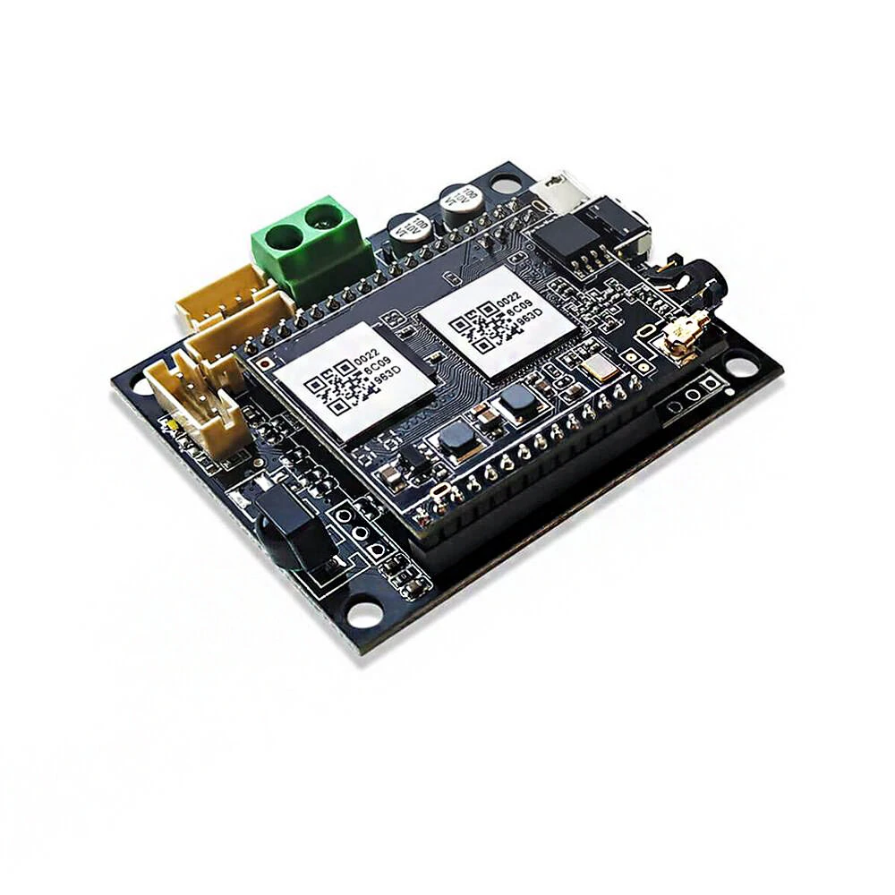
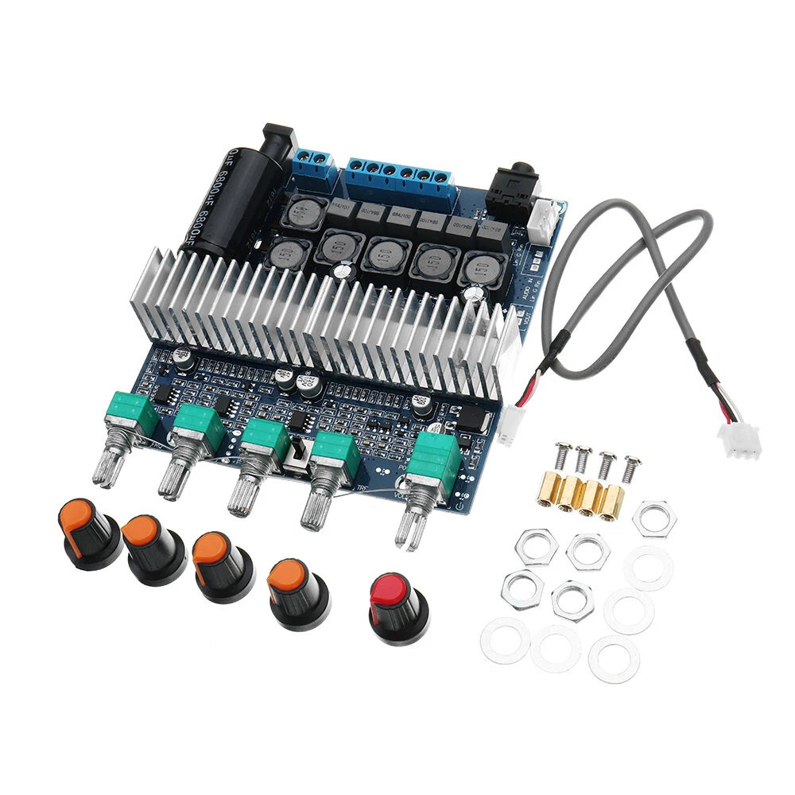
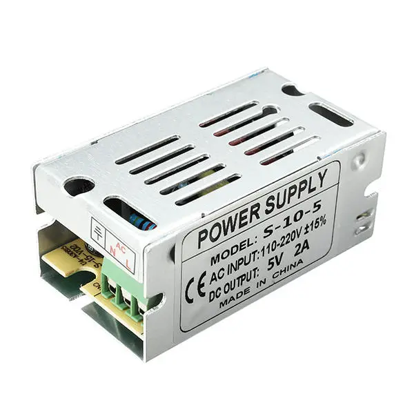
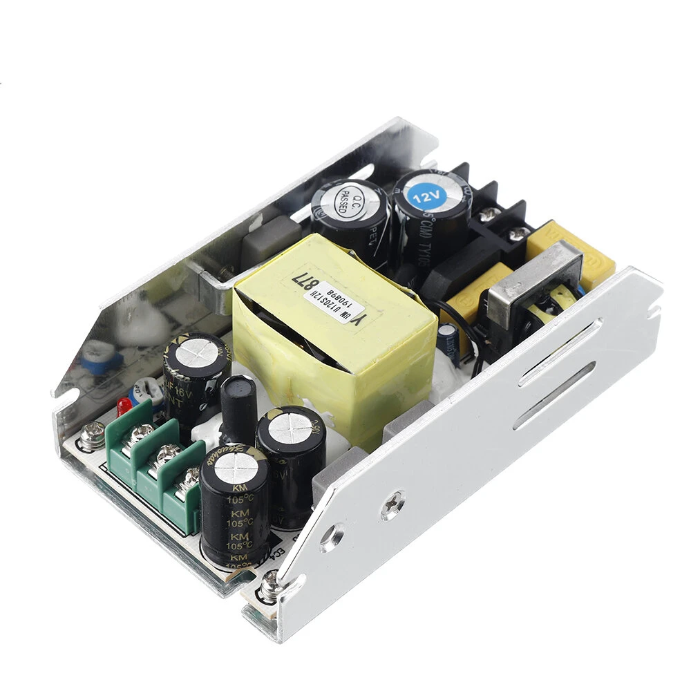

# Amplificateur 2CH+1
## Amplificateur audio Stéréo + Basses
Tout est dit.

## Liste des composants :
* <a href="https://www.banggood.com/fr/Up2stream-Mini-V2-WiFi-Audio-Receiver-Module-24bit-192kHz-FLAC-Multiroom-for-AmplifiedBoard-p-1669568.html">
    
Up2stream - Mini module récepteur audio WiFi 24bit 192 kHz FLAC

    
  </a>
* <a href="https://www.banggood.com/fr/TPA3116-2_1-DC-12V-24V-50W+50W+100W-HIFI-Digital-Audio-Amplifier-Board-p-1303084.html">
    
Amplificateur Audio Classe D avec 2xTPA3116 2.1 DC 12V-24V 50W + 50W + 100W

    
  </a>
* <a href="https://www.banggood.com/fr/AC-110-220V-To-DC-5V-2A-10W-Driver-Switch-Power-Supply-Transformer-For-LED-Strip-Light-p-1094518.html">
    
Alimentation AC 110-220V vers DC 5V 2A 10W

    
  </a>
* <a href="https://www.banggood.com/fr/UM-U120S-AC-to-DC-5V-or-12V24V-15A-or-10A-or-5A-120W-Switching-Power-Supply-Module-AC-to-DC-Converter-120W-Regulated-Power-Supply-p-1758462.html">
    
Alimentation à découpage 120W - UM-U120S AC à DC 24V/5A (sélectionner le modèle 24V)

    
  </a>

## Caisson

D'après : [Astuces Pratiques - Plan caisson de basse pour haut parleur 30cm](https://www.astuces-pratiques.fr/electronique/plan-caisson-de-basse-pour-haut-parleur-30cm)

### Liste des coupes

Réalisé en MDF de 18mm pour toutes les planches.

* Dessus & dessous :

	2 fois, 390mm x 630mm
  
* 2 Côtés :

	2 fois, 480mm x 630mm
	
* Fond :

	1 fois, 480mm x 360mm
	
* Façade :

	1 fois, 400mm x 360mm

* Évent :

	1 fois, 340mm x 360mm

> les côtes de 360mm pourront être réduites par ponçage pour rentrer entre les côtés : théoriquement 354mm pour des épaisseurs de 18mm.

### Assemblage

L'assemblage se fait à la colle blanche avec des serre-joints de 50cm et des équerres. Dans la description initiale il est recommandé d'ajouter des vis, ce que je n'ai pas fait. En tout état de cause il faudra pré-percer les trous de chaque vis pour éviter l'éclatement des planches.

1. Placer le dessous à plat sur un support afin de pouvoir positionner les serre-joints ;
2. Encoller la tranche du premier côté et le positionner sur le dessous. Serrer et vérifiant l'équerrage par rapport au dessous. L'ajout (sans collage) du fond peut permettre de garantir l'angle du côté et mieux assurer son serrage. Laisser sécher jusqu'à 24h ;
3. Encoller la tranche du second côté et le fixer de manière identique au premier. Laisser sécher. Si vous posséder suffisamment de serre-joint (et de dextérité), vous pouvez fixer les 2 côtés en même temps ;
4. Vérifier la largeur du fond (poncer ou raboter au besoin) pour qu'il passe entre les côtés sans laisser de jour. Encoller les 3 côtés du fond et le fixer entre les côtés. Vérifier l'équerrage par rapport au dessous. On peut avancer le fond d'un centimètre ou le faire affleurer avec le dessous et les côtés ;
5. Préparer 2 cales de 8cm qui supporteront l'évent. Positionner ces cales de part et d'autre, puis encoller les côtés de l'évent avant de le positionner sur les cales. À noter que l'évent est reculé d'environ 6 cm par rapport aux côtés (40 + 18 = 58). Laisser sécher puis retirer les cales ;
6. Enfin préparer la façade en largeur et percer le cercle nécessaire au haut-parleur. Encoller les 2 côtés et positionner soigneusement la façade pour affleurer l'évent et respecter le retrait de 4 cm (équerrage). Serrer et laisser sécher.

